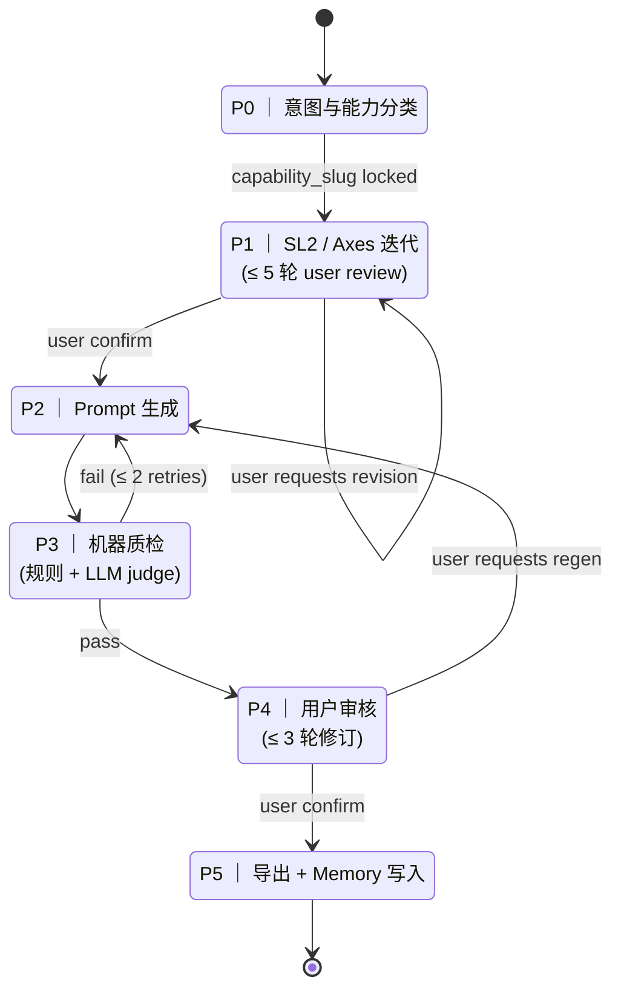

# t2v_promptgen

Automated specialty-capability prompt-set generator for T2V evaluation.

## 概念

针对 T2V 模型的**专项能力测评**(人手 / 人体 / 运镜 / 物理仿真 / 美学 / 文本生成 / 情绪 / ...),按需自动生产覆盖率 100% 的 prompt set,配套**维度说明书**给评测员在 GSB AB-test 平台勾选用。

与已有的 `elite_150_v3`(通用能力测评)互**独立**,通过 metadata 区分。

## 工作流(5 Phase 状态机)



## 决策记录(已锁定)

| 项 | 决策 |
|---|---|
| 维度命名 | 独立 `SL2` 库,可继承自通用 L1+L2 |
| 难度比例 | medium 60% / hard 40%(无 easy) |
| Set 大小 | `max(40, axes笛卡尔积 × 1.5)`,上限 120 |
| Stress case | 必有 30%,`is_stress` 独立字段 |
| 评测产物 | 维度说明书(给 GSB 评测员勾选用),双语 |
| Capability 模板 | 无预置,首次跑后入 memory |
| Memory 跨 run | 默认提示继承上一版 |
| Seed pool 容量 | 200 / 能力,时间淘汰 |
| LLM provider | 全程同一个,默认 Claude Opus 4.7 |
| 多人协作 | v1 不支持 |
| 与通用集协同 | 独立 |

## 工程结构

```
t2v_promptgen/
├── core/
│   ├── schema.py            # Pydantic 数据模型
│   ├── state.py             # SQLite run-state 持久化
│   └── orchestrator.py      # 状态机驱动
├── memory/
│   ├── store.py             # Capability vN 读写
│   └── seed_pool.py         # 历史样本池(200 上限 + 时间淘汰)
├── phases/
│   ├── intake.py            # P0
│   ├── dimensions.py        # P1
│   ├── prompts.py           # P2
│   ├── qa.py                # P3 (orchestrator-side)
│   └── export.py            # P5
├── qa/
│   ├── rules.py             # 确定性规则
│   ├── difficulty.py        # 启发式难度打分
│   └── judge.py             # LLM judge
├── evaluator/
│   ├── handbook_md.py       # 维度说明书 Markdown
│   └── handbook_json.py     # 平台 ingest JSON
├── llm/
│   ├── base.py              # LLMClient Protocol
│   └── providers/
│       ├── anthropic_client.py
│       ├── openai_client.py
│       └── ...
└── cli.py                   # 入口
```

## 存储

```
~/.t2v_promptgen/
├── runs.db                  # SQLite: run state, 用于 resume
├── memory/
│   ├── capabilities/
│   │   ├── human_hand/
│   │   │   ├── v1__2026-05-14__hash.yaml
│   │   │   ├── v2__2026-05-20__hash.yaml
│   │   │   └── latest.lnk
│   │   └── ...
│   ├── seed_pool/
│   │   └── human_hand.jsonl   # 历次 P4-confirmed 优秀 prompts
│   └── index.json
└── config.yaml              # provider / model / cost limits
```

## CLI

```bash
t2v-promptgen create --capability "人手生成能力"
t2v-promptgen resume <run_id>
t2v-promptgen list
t2v-promptgen memory list
t2v-promptgen memory show <slug> --version N
t2v-promptgen memory export <slug>
t2v-promptgen export <run_id> --to ./out/
```

## 状态

**v0.5** ← 你正在看 ｜ 代码骨架(空函数 + Pydantic 模型),等 review
v0.6 ← 实现 Phase 0/1(意图分类 + 维度生成 LLM 调用)
v0.7 ← 实现 Phase 2/3(prompt 生成 + 质检)
v0.8 ← 实现 Phase 4/5(用户交互 + 导出)
v1.0 ← 端到端跑通"人手"能力
