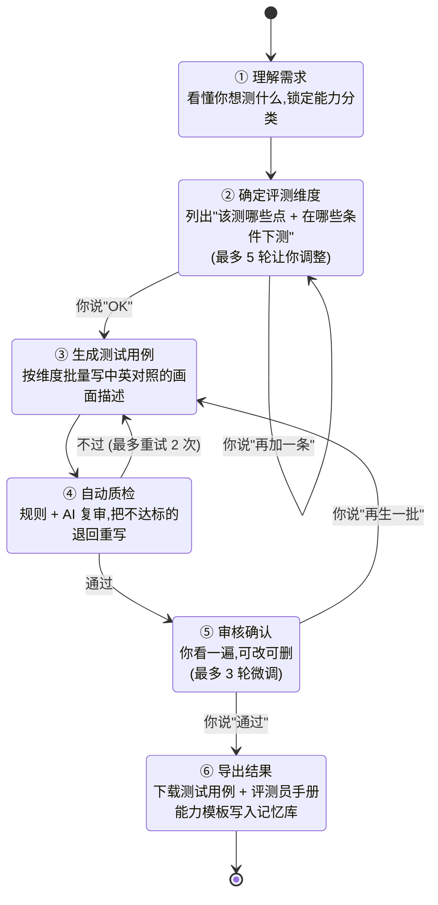

# t2v_promptgen

**自动给 T2V(文生视频)模型出测试题。**

你说一句"我想测视频模型生成人手的能力",它就自动:
1. 列出该测哪些具体细节(手指数量对不对、关节自不自然、握东西稳不稳...)
2. 批量写测试用例(中英对照,有易有难)
3. 配套生成评测员打分手册

产物可以直接交给评测员在 GSB(Good/Same/Bad)AB 对比平台上勾选。

---

## 这是什么 / 不是什么

| | |
|---|---|
| ✅ 是 | 针对**某一个能力**(人手/人体/运镜/物理/美学/文字...)出**专项**测试题 |
| ❌ 不是 | 通用全方位评测 — 那是另一个项目 `elite_150_v3`,本项目独立运作 |

两者通过 metadata 区分,各自有自己的标签库和管线,互不打扰。

---

## 一次任务长什么样



每步在网页上都是单独一页,做完点确认才进下一步。

---

## 几个关键词(本项目内部叫法)

| 内部叫法 | 大白话 |
|---|---|
| **能力(capability)** | 你这次想测什么 — 比如"人手"、"运镜"、"物理碰撞" |
| **检查项(SL2)** | 该能力下的细分翻车点。评测员看完视频要逐条勾"是 / 否"。例:对人手能力的检查项 = 手指数量是否正确、关节弯曲是否自然、握物是否稳定... |
| **测试变量(Axes)** | 每条用例会变化的条件。例:操作复杂度、光照、有没有手套、特写还是远景 |
| **测试用例 / Prompt** | 一段画面描述。模型看着它生视频。每条中英双语,带难度标注 |
| **故意刁难(Stress case)** | 占 30% 的极端用例,专门用来"试图把模型逼出错",看它边界在哪 |
| **评测员手册** | 给评测员的打分指南。说明每条检查项应该看什么、什么算翻车 |

---

## 设定参数(已定,不会再改)

| 项 | 取值 | 为什么 |
|---|---|---|
| 难度比例 | 中等 60% / 困难 40% | 简单题区分不出模型能力,不要 |
| 用例数量 | `max(40, 测试变量笛卡尔积 × 1.5)`,上限 120 | 既保证基础覆盖,又不让人评到崩溃 |
| 故意刁难占比 | 必有 30% | 不刁难就摸不到模型上限 |
| 中英对照 | 每条都有 | 国内外模型都能测 |
| 维度调整轮数 | 最多 5 轮 | 防止反复折腾 |
| 用例调整轮数 | 最多 3 轮 | 同上 |
| 历史样本池 | 每能力存 200 条优秀用例,按时间淘汰 | 给下次同能力任务做参考 |
| 多人协作 | v1 不支持 | 单人单任务,先把流程跑通 |

## Prompt 必须是"视频"不是"图片"

T2V 生成 5 秒视频,如果 prompt 只描述一张静态图,模型就抓不到时序信息。所以每条 prompt 强制要求:

| 要求 | 怎么强制 |
|---|---|
| **至少 2 个动作动词**(走 / 握 / 转身 / 推开...) | 生成时 system prompt 硬性规定 + 生成后扫描词典,不到 2 个直接丢掉重生 |
| **≥40% 用例带时序结构**(先…然后…/突然/逐渐/最后) | system prompt 示例对照 + 难度评分给时序词加权 |
| **不准写"静止 / 不动 / 纹丝不动"** | 出现一律丢弃(除非 SL2 明确测背景稳定性) |
| **镜头运动必填** | 从固定 9 种里选一种(不动 / 推近 / 跟随 / 第一视角……) |

✅ 正例:"她先抓起胡萝卜,然后用刀切下三段,最后将刀放回案板"
❌ 反例:"一只手握住胡萝卜,纹理清晰,手指自然弯曲"(只是图片描述)

---

## 怎么跑

### 网页版(推荐,适合演示和真用)

```bash
pip install fastapi uvicorn jinja2 python-multipart pydantic
cd /path/to/t2v_benchmark
uvicorn t2v_promptgen.web.app:app --reload --port 8765
```

浏览器开 `http://localhost:8765`,按页面提示往下点就行。详细说明见 [`web/README.md`](web/README.md)。

### 命令行(自动化/批量)

```bash
t2v-promptgen create --capability "人手生成能力"   # 新建任务
t2v-promptgen resume <run_id>                       # 中断后恢复
t2v-promptgen list                                  # 列出所有任务
t2v-promptgen memory list                           # 看已存的能力模板
t2v-promptgen memory show <slug> --version N        # 查具体某版模板
t2v-promptgen export <run_id> --to ./out/           # 重新导出文件
```

### 用哪个 AI 服务

支持以下任一,**不绑死单一供应商**:

| 类型 | 选项 |
|---|---|
| 中转接口(一个 key 调多家) | yibuapi、自定义 OpenAI 兼容 endpoint |
| 官方接口 | Anthropic、OpenAI、DeepSeek、阿里 Qwen、月之暗面 Moonshot、智谱 GLM、SiliconFlow |

推荐配置(便宜 + 质量):
- **分析模型**(用一次,决定测什么):`deepseek-v4-pro` 或 `claude-opus-4-7`
- **生成模型**(写大量用例):`deepseek-chat` 或 `gpt-4o-mini`

API key 可以网页临时填(只用一次,不存),也可以配进环境变量 / `~/.t2v_promptgen/config.yaml` 长期用。详见网页 ⚙ API 设置页。

---

## 你最终拿到什么文件

任务跑完会有 4 个产物:

| 文件 | 内容 | 给谁用 |
|---|---|---|
| `prompts.jsonl` | 测试用例主文件(中英 + 标签) | 喂给视频模型生视频 |
| `evaluator_handbook.md` | 评测员说明书(Markdown) | 评测员打印照着勾 |
| `evaluator_handbook.json` | 同上,结构化 JSON 版 | 给评测平台导入 |
| `coverage_report.json` | 每个检查项 × 每种条件被多少条用例覆盖 | 自查"有没有测漏" |

同时,这次任务里 AI 设计出来的 "检查项 + 测试变量" 会自动存为该能力的**模板**,下次测同一能力可以直接继承,不用重新设计。

---

## 代码结构

```
t2v_promptgen/
├── core/
│   ├── schema.py            # 数据模型(Pydantic)
│   ├── state.py             # 任务状态持久化(SQLite)
│   └── orchestrator.py      # 状态机:决定下一步去哪
├── memory/
│   ├── store.py             # 能力模板的版本化存储
│   └── seed_pool.py         # 优秀用例池(200 上限 + 时间淘汰)
├── phases/                  # 六步流程,每步一个模块
│   ├── intake.py            #   ① 理解需求
│   ├── dimensions.py        #   ② 确定评测维度
│   ├── prompts.py           #   ③ 生成测试用例
│   ├── qa.py                #   ④ 自动质检
│   └── export.py            #   ⑥ 导出
├── qa/
│   ├── rules.py             # 确定性规则(长度/格式/敏感词)
│   ├── difficulty.py        # 难度打分(启发式)
│   └── judge.py             # AI 复审
├── evaluator/
│   ├── handbook_md.py       # 生成 Markdown 手册
│   └── handbook_json.py     # 生成 JSON 手册
├── tags/
│   └── library.py           # 2231 个 L4 场景标签库
│                            # 用来在生成用例时注入具体场景,避免"复杂场景"这种空话
├── llm/
│   ├── base.py              # LLM 客户端协议
│   └── providers/           # 各家服务的适配器
│       ├── openai_compat.py # 一个类搞定所有 OpenAI 兼容的服务
│       ├── anthropic_client.py
│       └── ...
├── web/                     # FastAPI 网页前端
└── cli.py                   # 命令行入口
```

---

## 文件存放在哪

```
~/.t2v_promptgen/
├── runs.db                  # 所有任务的状态(断了可恢复)
├── memory/
│   ├── capabilities/
│   │   ├── human_hand/      # "人手"能力的历史模板
│   │   │   ├── v1__2026-05-14__hash.yaml
│   │   │   ├── v2__2026-05-20__hash.yaml
│   │   │   └── latest.lnk   # 指向最新版
│   │   └── ...
│   ├── seed_pool/
│   │   └── human_hand.jsonl # 历次通过审核的好用例
│   └── index.json
└── config.yaml              # API 服务 / 模型 / 费用上限
```

---

## 现在跑到哪一步了

| 版本 | 状态 | 内容 |
|---|---|---|
| v0.5 | ✅ 完成 | 代码骨架 + Pydantic 模型 |
| v0.6 | ✅ 完成 | 网页前端 + 真实 LLM 接入 + 场景标签库 + 双模型分工 |
| v0.7 | ✅ 当前 | P0 LLM 意图分类 / P1 维度评审 / P3 三层质检(规则 + 自然度 + 覆盖反核)/ 动态时序强制 / 主体类型 + 数量双重多样性配额 |
| v0.8 | 🚧 进行中 | 任务持久化到 SQLite(目前内存,重启丢) + 能力模板继承 + 命令行 |
| v1.0 | 目标 | 端到端跑通"人手"能力,可交付给评测团队使用 |

已验证:用 `deepseek-v4-pro` + `deepseek-chat` 跑出 60 条人手测试用例,7/7 检查项全覆盖,故意刁难占 33%,耗时约 260 秒,产物在 [`out/human_hand_60.jsonl`](out/human_hand_60.jsonl)。
