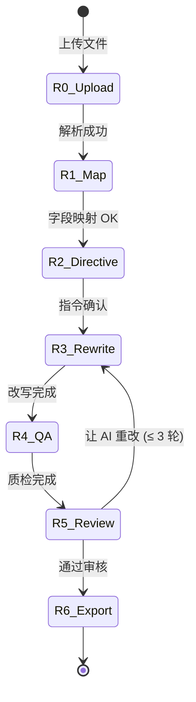

# Prompt 改写功能设计文档(v0)

> 状态:**草案,等待 refine**。任何决策都可以推翻,Open Questions 章节是给用户拍板的。

---

## 1. 一句话

让用户**导入已有的 prompt 列表**(JSON / TXT / Excel / CSV),通过 **预设改写卡片 + 自由描述** 批量变形(主体替换 / 难度提升 / 风格切换 ...),走和现有生成流程同样的 **AI 质检 + 审核 + 导出**。

---

## 2. 用户场景

| 场景 | 例子 |
|---|---|
| 已有一批通用 prompt,想测某个细分能力 | 把 elite_150 里的 prompt 改写成全部测"人手" |
| 想用同一批 prompt 测不同模型表现 | 复制一份,改成"夜晚 + 慢动作"做对比 |
| 已有的 prompt 太简单,想提难度 | 单步动作 → 多步时序、单主体 → 多主体交互 |
| 跨能力借鉴 | 把"camera_motion"的 prompt 改写成测"physics" |
| 语言风格本地化 | 英文 prompt → 中英对照 + 加中国元素 |

---

## 3. 总体流程图



Phase 命名 **R0-R6** 区分于现有 **P0-P5**,但底层数据结构和质检/审核完全复用。

---

## 4. 数据模型

### 4.1 Run 扩展(向后兼容)

```python
class Run(BaseModel):
    # ... 现有字段不变 ...

    # 新增:任务来源
    source: Literal["generate", "rewrite"] = "generate"

    # rewrite 任务专用字段
    source_file: SourceFile | None = None        # 上传的原文件元信息
    source_prompts: list[SourcePrompt] = []      # 解析后的原始 prompt 列表
    field_mapping: dict[str, str] = {}           # {语义键: 文件列名}
    rewrite_directive: RewriteDirective | None = None
    rewrite_round: int = 0
    rewrite_max_rounds: int = 3
```

### 4.2 新增 schema

```python
class SourceFile(BaseModel):
    filename: str
    format: Literal["json", "jsonl", "txt", "csv", "xlsx"]
    size_bytes: int
    row_count: int                               # 解析后总条数
    sample: list[dict] = []                      # 前 5 行,展示用

class SourcePrompt(BaseModel):
    """归一化后的原始 prompt."""
    source_id: str                               # 用户文件里的原始 id 或行号
    original_text: str                           # 原文(中或英)
    original_text_en: str | None = None          # 双语原文
    metadata: dict = {}                          # 文件里其他字段透传
    selected: bool = True                        # 是否参与本次改写

class RewriteDirective(BaseModel):
    """改写指令 — 卡片 + 自由文本."""
    transforms: list[Transform] = []             # 选中的预设卡片
    free_text: str = ""                          # 用户自由描述
    target_count: int | None = None              # 限制改写多少条
    preserve_original: bool = True               # 保留原 prompt 在导出里

class Transform(BaseModel):
    """单条预设改写指令."""
    id: str                                      # e.g. "subject_swap"
    name_zh: str                                 # e.g. "主体替换"
    params: dict = {}                            # 卡片填的参数

class PromptEntry(BaseModel):
    # ... 现有字段不变 ...

    # 新增:改写溯源
    source_id: str | None = None                 # 关联到 SourcePrompt.source_id
    rewrite_diff: str | None = None              # LLM 生成的"改了什么"描述
```

### 4.3 现有字段如何继续工作

| 字段 | rewrite 任务里的角色 |
|---|---|
| `capability_slug` | 可选 — 用户能选"我要把这批改成测什么能力",影响 judge 时的对照 |
| `sl2_list` | 可选 — 如果指定能力就生成 SL2,用作改写指令的"约束"(让 LLM 改写时考虑) |
| `axes` | 不强制 — rewrite 不需要预设 axes |
| `recommended_tags` | 可选 — 用户可以指定"改成符合 D3=V2 + D5=F1 的 prompt" |
| `prompts` | **rewrite 后的产物存在这里**,和 generate 任务一样 |
| QA 字段(qa_*) | 完全复用 |
| `is_stress / difficulty / subject_*` | LLM 改写时填,和现有评分器/过滤器接口一致 |

---

## 5. R0 文件读取

### 5.1 支持格式

| 格式 | 探测 | 解析库 | 备注 |
|---|---|---|---|
| `.json` | 后缀 + 首字符 `[` 或 `{` | stdlib | 支持 `[{...}]` 和 `{"prompts": [...]}` |
| `.jsonl` | 后缀 + 多行 | stdlib | 一行一个 obj |
| `.txt` | 后缀 | stdlib | 一行一个 prompt;空行分隔块也行 |
| `.csv` | 后缀 | `pandas` | 自动探测 delimiter |
| `.xlsx` | 后缀 | `openpyxl` | 默认第一个 sheet,可换 |

### 5.2 编码

- 优先 UTF-8,失败回退 GBK / GB18030
- 用 `chardet` 兜底
- 解析失败时把出错的前 20 字节 + 错误信息上报给用户

### 5.3 解析输出

统一成:
```python
list[dict]    # 每个 dict 是一行原始数据
```

把这个 list 存进 `SourceFile.sample[:5]` 给 UI 预览。

---

## 6. R1 字段映射

### 6.1 待解决问题

每个文件的 key 都不一样:

```json
{ "id": 1, "prompt": "..." }                          ← 标准
{ "id": 1, "description": "...", "en": "..." }        ← 中英双语
{ "id": 1, "caption": "...", "tags": [...] }          ← caption + 标签
{ "rowIdx": 1, "text": "..." }                        ← 行号 + text
```

### 6.2 语义 key

我们内部认 4 个语义键,用户把文件列对应过来:

| 语义键 | 必填 | 用途 |
|---|---|---|
| `prompt_zh` | ⚠ 二选一 | 中文 prompt 文本 |
| `prompt_en` | ⚠ 二选一 | 英文 prompt 文本 |
| `source_id` | 否 | 原始 id,缺则用行号 |
| `metadata` | 否 | 其他列全部归到 metadata |

### 6.3 自动猜测(LLM 辅助)

打开映射页时,后台跑一次小 LLM 调用:

```
给定列名 + 3 行样本数据 → 猜哪列是 prompt_zh / prompt_en
返回 {prompt_zh: "text", prompt_en: null, ...} + confidence
```

LLM 不可用就走启发式:
- 列名含 `prompt / description / caption / text` → prompt_zh
- 含 `en / english` → prompt_en
- 含 `id / idx` → source_id

UI 允许用户改。

---

## 7. R2 改写指令

两种输入方式,**可叠加**。

### 7.1 预设卡片(10 个左右,固化常见操作)

| 卡片 id | 名称 | 参数 | 例子 |
|---|---|---|---|
| `subject_swap` | 主体替换 | from / to(可选 D1 值) | 单人 → 多人,人 → 动物,有生命 → 无生命 |
| `scene_shift` | 场景迁移 | target_scene(D6) | 室内 → 户外,白天 → 夜晚 |
| `difficulty_up` | 难度提升 | levels(1-3) | 单步 → 多步,加因果链,加遮挡 |
| `style_apply` | 风格转换 | target_style(D7) | 应用"韦斯安德森 / 油画印象派 / 3D 渲染" |
| `camera_set` | 镜头切换 | target_camera(D4) | 固定 → 跟随,加航拍开头 |
| `speed_adjust` | 速度调整 | speed(D3) | 加慢动作 / 加变速 |
| `multi_subject` | 改成多主体 | count(2/3+) | 单主体 prompt → 双主体交互 |
| `add_temporal` | 添加时序 | steps(2/3/4+) | 单一动作 → 多段顺序动作 |
| `localize_zh` | 本土化 | flavor | 加入中国元素 / 节庆场景 |
| `stress_inject` | 故意刁难 | mode | 加遮挡 / 加同步 / 加不可逆变化 |
| `bilingualize` | 中英对照补全 | direction | 只有中文 → 补英文,反之 |

每张卡片有:
- 中文名 + 一行说明
- 0-2 个参数(下拉或输入框)
- 启用开关

卡片是有序应用的(先应用 #1,再 #2,...),UI 可以拖拽排序。

### 7.2 自由文本

下面一个 textarea,例:

> "把所有 prompt 改成测试'手部精细操作',保留中文风格,加 2 段时序"

LLM 改写时同时看卡片和文本,卡片是结构化约束,文本是补充意图。

### 7.3 改写范围

```
○ 全部 N 条
○ 满足条件的 (筛选器:难度=/标签=/包含关键词=)
○ 我手动勾选的 (checkbox 列表)
```

---

## 8. R3 改写执行

### 8.1 一条 prompt 的 LLM 调用

System prompt 大致:

```
你是 T2V prompt 改写专家。给定原 prompt + 改写指令,产出改写后的 prompt。

原 prompt:{original_text}
原 prompt 中英对照:{prompt_zh / prompt_en}
原元数据:{metadata}

改写卡片(依次应用):
1. subject_swap: 单人 → 双人交互
2. difficulty_up: 加 3 段时序

自由意图:加入中国节庆元素

可用词表(供选填):
- D1 主体: S1-S5
- D4 镜头: C1-C13
- ...

输出 JSON:
{
  "prompt_zh": "...",
  "prompt_en": "...",
  "subject_type": "human|...",
  "subject_count": 2,
  "camera_zh": "镜头XX",
  ...
  "diff": "把单人改成双人;加了三段顺序动作;场景换到春节庙会"
}
```

### 8.2 批处理

- 每批 10 条,温度 0.4
- 单条失败不影响整批
- 失败的丢进 `failed_rewrites` 列表,UI 显示
- 用户可"只重试失败的"

### 8.3 长 prompt 列表(>200 条)的策略

- 进度条 + 后台任务
- 每完成 1 批就把已完成的写进 `run.prompts`,UI 轮询刷新
- 用户可以中途按"暂停",已完成的进入审核

---

## 9. R4 质检 — 直接复用 P3

完全用现有 `phases/qa.py::run()`:
- 规则检查(长度 / 禁词 / 字段)
- 自然度评分(中英 0-10)
- 覆盖反核(LLM 独立判断 SL2 — 只有用户选了能力才跑这层)

外加 **改写专属检查**:
- **保持率检查**:改写后的 prompt 不能和原文几乎一样(simhash 距离 < 阈值就警告)
- **指令遵循度**:LLM 判定"改写后是否真的执行了用户的指令"(0-10 分)

输出 `QAReport` 多两个字段。

---

## 10. R5 审核(Diff 视图)

UI 重点:**对比** > 列表。

```
┌─────────────────────────────────────────────────────────────┐
│  原 prompt                    │  改写后                       │
│  (灰底)                       │  (白底,改的地方高亮)        │
│  一个人在咖啡店前走过          │  两位老友在春节庙会前 先击掌  │
│                              │  然后并肩走入红灯笼下          │
│                              │                              │
│  ✓ 自然度 9/9                 │  💡 改写说明:               │
│  ⚠ 覆盖反核:judge says ...  │     - 单人 → 双人              │
│                              │     - 加 3 段时序             │
│                              │     - 中国节庆元素            │
│                              │                              │
│  [接受] [拒绝] [让 AI 重改]   │                              │
└─────────────────────────────────────────────────────────────┘
```

操作:
- 单条接受 / 拒绝
- 全部接受 / 全部拒绝
- 部分接受 + "让 AI 再改一遍剩下的"
- 单条用文字反馈"再加点 XX"→ 单条 LLM 重改

迭代上限:`rewrite_max_rounds = 3`(可调)。

---

## 11. R6 导出

和现有 P5 完全一致 + 一项新选项:

```
☑ 测试用例主文件 (prompts.jsonl)        — 含改写后版本
☐ 评测员说明书 (handbook.md)           — 仅当指定了能力时
☐ 覆盖报告 (coverage.json)
☑ Diff 报告 (rewrite_diff.jsonl)       — 新增:原 ↔ 新 + 指令 + 改了什么
☐ 仅导出改了的(skip 拒绝的)
```

JSONL 字段:

```json
{
  "id": "rw_001",
  "source_id": "orig_42",
  "prompt_zh": "...",
  "prompt_en": "...",
  "original_text": "...",
  "rewrite_diff": "把单人改成双人;加了三段顺序动作",
  "rewrite_directive": {"transforms": [...], "free_text": "..."},
  "qa_passed": true,
  ...
}
```

---

## 12. UI 整合

### 12.1 首页改造

把现在的"新建评测任务"卡片拆成 2 个 tab:

```
[新建任务]
  ┌─────────────────────────┬────────────────────────────┐
  │  🪄 从零生成              │  📋 改写已有 prompt          │
  │  描述你想测什么 → AI 出题  │  上传 prompt 文件 → 改写    │
  │  适合:新能力探索          │  适合:已有库 + 增量扩充     │
  └─────────────────────────┴────────────────────────────┘
```

### 12.2 phase tracker

Rewrite 任务的进度条:

```
理解需求 → 字段映射 → 改写指令 → 改写中 → 自动质检 → 审核确认 → 导出结果
   R0       R1        R2        R3       R4         R5         R6
```

代码层面:`PHASE_LABEL_ZH` 加 R* 别名,UI 根据 `run.source` 决定显示哪一套。

### 12.3 复用模板

- `base.html` 不动
- `index.html` 加 tab(2 张卡片)
- 新建 `rewrite_upload.html` (R0) / `rewrite_map.html` (R1) / `rewrite_directive.html` (R2)
- `generating.html` 复用(R3 改写中)
- `review.html` 加 `is_rewrite` 分支,渲染 diff 视图
- `export.html` 复用 + 新增 diff 下载按钮

---

## 13. 后端复用清单

| 现有模块 | 复用情况 |
|---|---|
| `qa/rules.py` | 直接用 |
| `qa/judge.py naturalness_batch` | 直接用 |
| `qa/judge.py coverage_audit_batch` | 仅在指定能力时用 |
| `qa/difficulty.py score` | 改写后重新打分 |
| `phases/qa.py run()` | 直接用 |
| `web/llm_phases.py` | 加 `rewrite_prompts_real()` 函数 |
| `core/annotation_schema.py` | 改写指令引用其中的 D1-D8 值 |
| `core/capability_registry.py` | 用户可选指定能力,沿用 slug |
| `web/app.py` | 加 R0-R6 路由,复用 P3/P4/P5 |

新增模块:

| 新文件 | 内容 |
|---|---|
| `phases/rewrite.py` | 改写阶段编排 |
| `parsers/prompt_loader.py` | 多格式解析 |
| `parsers/field_mapper.py` | LLM 辅助 + 启发式字段映射 |
| `qa/rewrite_quality.py` | 保持率 + 指令遵循度检查 |
| `web/templates/rewrite_*.html` | 上传/映射/指令 三页 |

---

## 14. LLM 调用点 & 成本预估

| 调用 | 何时触发 | 模型 | 平均 token | 60 条样本估算 |
|---|---|---|---|---|
| 字段映射猜测 | R1 进入 | chat | 500 in / 200 out | $0.0001 / 次 |
| 主体改写 | R3 每批 | chat | 800 in / 600 out | $0.005 / 批 × 6 = $0.03 |
| 改写 diff 描述 | R3 每条(可合并到主体改写) | 0 额外 | — | — |
| 保持率检查 | R4 | chat | 500 in / 100 out | $0.001 / 批 |
| 指令遵循度 | R4 | chat | 800 in / 300 out | $0.003 / 批 |
| 自然度 + 覆盖反核 | R4(复用 P3) | chat | 同 P3 | $0.02 |
| 单条迭代重改 | R5 | chat | 600 in / 600 out | $0.001 / 条 |

**60 条改写任务全跑一遍 ≈ $0.06**(deepseek 价格)。100 条 ≈ $0.10。

---

## 15. 兼容性 & 迁移

### 15.1 向后兼容

- 旧 `Run` 实例没有 `source` 字段 → 默认 `"generate"`,行为完全不变
- 旧 `PromptEntry` 没有 `source_id / rewrite_diff` → 都是 `None`,导出时不显示
- 数据库迁移(v0.8 SQLite 落地时):新字段加 NULL default,无需回填

### 15.2 现有用户感知

- 首页多一个 tab,默认还停在"从零生成",老用户感知 = 0
- 走 generate 路径,所有 phase / UI / 导出和现在一模一样

---

## 16. 边界 & 风险

| 风险 | 应对 |
|---|---|
| 大文件(10k 行) | 流式解析 + 抽样改写选项("从 10k 里随机抽 500 改") |
| Excel 多 sheet | UI 列 sheet 名,用户选一个 |
| 损坏的输入(编码 / JSON) | 解析失败给具体行号 + 出错前后 20 字节 |
| LLM 改写后改得太狠(原意丢失) | 保持率检查 + UI diff 高亮 + 接受率提示 |
| LLM 改写得太轻(几乎没改) | 同上,加"再改一遍"按钮 |
| 卡片 + 自由文本冲突 | 让 LLM 自己取舍,在 diff 里说明取舍理由 |
| 改写费用预估超出预算 | R2 确认前显示"本批预计消耗 $X"，用户确认才动 |
| 用户文件含敏感信息 | 上传文件只放内存(配合 SQLite 落盘时加 PII 字段过滤) |

---

## 17. 开放问题(等你拍板)

> 这些决定了 UI 复杂度 / 实施工作量,先定再开始写代码。

**Q1. 入口位置** — 首页 tab(两张卡片并排)vs 顶部菜单独立项?
推荐:tab。

**Q2. 改写后是否保留原 prompt** — 默认保留(diff 视图必需) vs 默认覆盖?
推荐:保留。导出时选项控制要不要带上 original 列。

**Q3. 预设卡片数量** — 设计文档里列了 11 张,要全做还是先做 5 张高频?
推荐:首版 5 张(subject_swap / scene_shift / difficulty_up / style_apply / camera_set),其他迭代加。

**Q4. 卡片 + 自由文本叠加规则** — 必须填一种?可以都填?互斥?
推荐:都可以填,LLM 自己合成,空都行(但空时禁止"开始改写")。

**Q5. 文件大小上限** — 多大算太大?要不要上传到服务器临时存还是只内存?
推荐:5MB 内存,>5MB 拒绝并提示"先抽样"。

**Q6. 改写迭代轮数** — 现在 P4 是 3 轮,这里也 3 轮?
推荐:同样 3 轮。

**Q7. 是否允许"批量内不同 prompt 用不同指令"** — 进阶功能,工作量大
推荐:**首版不做**。整批用同一套指令。下版再考虑分组。

**Q8. 是否需要指定 capability** — rewrite 不强制要 slug
推荐:可选。指定了 slug 就跑覆盖反核,不指定就跳过。

**Q9. SQLite 持久化(v0.8)优先级** — 改写任务的状态比生成任务更重要(用户上传了文件,丢了很烦)?
推荐:rewrite 任务的 source_file + source_prompts 必须持久化,优先级 High。

**Q10. 单条编辑入口** — R5 审核页能不能直接编辑改写后的文本?
推荐:能。和现有 P4 的 `p4_edit_prompt` 路由对齐。

---

## 18. 实施路线(分 4 个 PR 落地)

> 等你 refine 完上面 Open Questions 再开始。

### PR-1 R0+R1 解析与映射(1 天)
- `parsers/prompt_loader.py` + 4 种格式
- `parsers/field_mapper.py` + LLM 辅助
- `rewrite_upload.html / rewrite_map.html` 两页
- POST /runs?source=rewrite

### PR-2 R2+R3 指令与改写(2 天)
- 5 张预设卡片 + 自由文本
- `phases/rewrite.py`
- `llm_phases.rewrite_prompts_real`
- `rewrite_directive.html`

### PR-3 R4+R5 质检 + Diff 审核(1 天)
- `qa/rewrite_quality.py`(保持率 + 指令遵循度)
- `review.html` 加 diff 视图分支
- 单条接受/拒绝/重改路由

### PR-4 R6 导出 + 兼容收尾(0.5 天)
- `export.html` 加 diff 报告
- `index.html` 加 tab
- 文档更新(README + web/README)

总:**4.5 天**,期间不影响现有功能。

---

## 19. 改了之后,系统是什么

```
两条流水线,共用质检 / 审核 / 导出:

GENERATE 流(现有):
  描述 → 维度 → 生成 → 质检 → 审核 → 导出
                      ↓
REWRITE 流(新增):    ↓
  上传 → 映射 → 指令 → 改写 → 质检 → 审核 → 导出
                              ↑共用层
```

一个完整的 T2V 评测体系:**冷启动**(从零生成)+ **增量扩充**(改写已有)两条腿走路。

---

> 等你逐条标记 Open Questions(标记"同意 / 改成 X"即可),我开始写代码。
